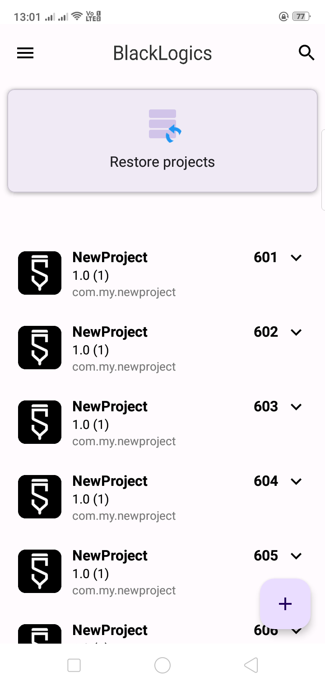
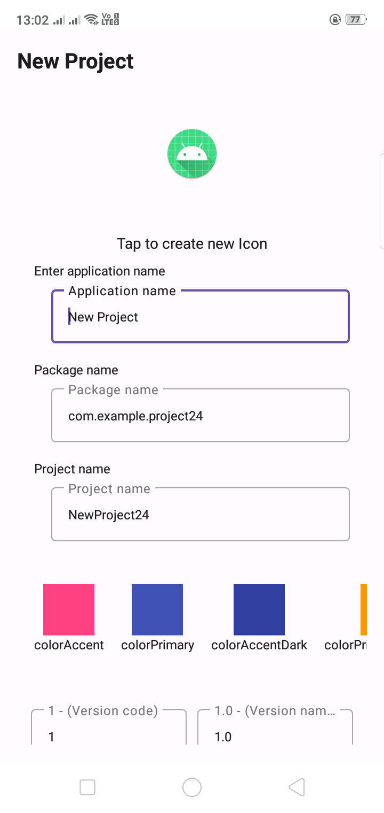
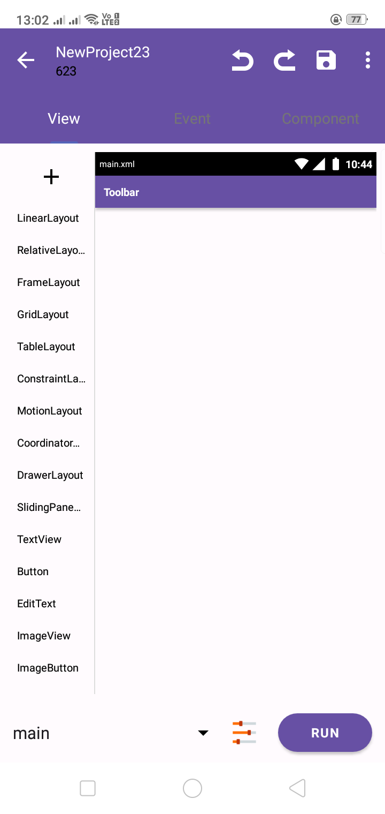
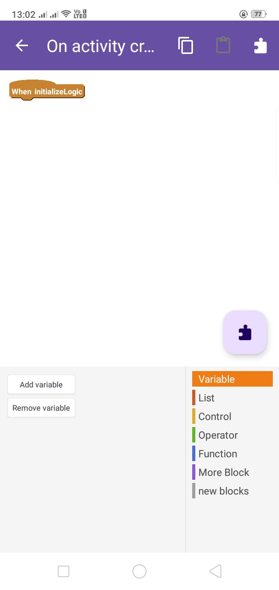

# BlackLogics

**BlackLogics** is a powerful open-source alternative to Sketchware. It allows developers to build Android applications visually using drag-and-drop components while integrating advanced features like Firebase, Material Design 1.9, multimedia support, and custom Nexus-style UI.

BlackLogics is built with a focus on performance, professional UI, and full customization — perfect for both beginners and advanced Android developers.

---

## 📸 **Screenshots & Demo**

### **🚀 Interactive Main UI**  
  

### **🔹 Create Project Ui**  
  

### **🚀 Design Activity UI**  
  

### **🔹 Logic Editor**  
  


## ✨ Features

- **Visual Drag & Drop App Builder**  
  Build apps without writing traditional code.

- **Material 1.9 Components**  
  Use professional-looking Material buttons, dialogs, toolbars, bottom navigation, and more.

- **Dark & Light Theme Support**  
  Seamless switching between dark and light UI modes.

- **Language Support**  
  Multi-language support including English and Hindi.

- **Nexus UI Components**  
  Custom-designed buttons, toolbars, bottom navigation, player UI, dialogs, etc.

- **Music & Video Player Integration**  
  Built-in audio and video players with advanced controls.

- **Video Editing Tools**  
  Convert video to audio, extract thumbnails, trim, and merge clips.

- **Firebase Integration**  
  Includes Firebase Auth, Realtime Database, and Storage support.

- **Authentication Modules**  
  OTP verification, QR Code Login, Fingerprint Login, and Two-Factor Authentication (2FA).

- **WhatsApp-style Chat System**  
  Real-time messaging with "seen" status, last message, and time.

- **Status Feature**  
  Post story/status that auto-deletes after 24 hours.

- **Custom Event Listeners**  
  Handle next/previous buttons, full-screen mode, and playback events easily.

---

## ⚙️ Installation Guide

> This project is **open-source** and ready to be built on Android Studio or Sketchware Pro.

### Requirements

- Android Studio / Sketchware Pro
- Android SDK 21 or higher
- Java 1.8+
- Internet Connection (for Firebase)

### Steps

1. **Clone the Repository**
   ```bash
   git clone https://github.com/NexusTeamOfficial/BlackLogics-Open-Source.git


2. **Open in Android Studio** or import in **Sketchware Pro**

3. **Sync Gradle** and resolve dependencies

4. **Run on your Android device or emulator**


## 👨‍💻 Contributing

We welcome all contributions to make BlackLogics even better!

### Steps to Contribute

* Fork this repository
* Create your feature branch: `git checkout -b feature/YourFeature`
* Commit your changes: `git commit -m 'Add feature'`
* Push to your branch: `git push origin feature/YourFeature`
* Submit a Pull Request

All contributors will be credited in the CONTRIBUTORS.md file.


## 🙌 Credits

**Developer:**

* `BlackLogics`

**Special Thanks:**

* `NexusTeam`
* `SmartIndiaGaming`

*Full credit goes to NexusTeam & SmartIndiaGaming for their major contributions and support.*


## 📄 License

```text
MIT License

Copyright (c) 2025 BlackLogics

Permission is hereby granted, free of charge, to any person obtaining a copy
of this software and associated documentation files (the "Software"), to deal
in the Software without restriction, including without limitation the rights  
to use, copy, modify, merge, publish, distribute, sublicense, and/or sell  
copies of the Software, and to permit persons to whom the Software is  
furnished to do so, subject to the following conditions:

The above copyright notice and this permission notice shall be included  
in all copies or substantial portions of the Software.

THE SOFTWARE IS PROVIDED "AS IS", WITHOUT WARRANTY OF ANY KIND, EXPRESS OR  
IMPLIED, INCLUDING BUT NOT LIMITED TO THE WARRANTIES OF MERCHANTABILITY,  
FITNESS FOR A PARTICULAR PURPOSE AND NONINFRINGEMENT. IN NO EVENT SHALL  
THE AUTHORS OR COPYRIGHT HOLDERS BE LIABLE FOR ANY CLAIM, DAMAGES OR OTHER  
LIABILITY, WHETHER IN AN ACTION OF CONTRACT, TORT OR OTHERWISE, ARISING  
FROM, OUT OF OR IN CONNECTION WITH THE SOFTWARE OR THE USE OR OTHER  
DEALINGS IN THE SOFTWARE.
```

---

## 🔗 Connect with Us

* **Telegram:** [@BlackLogicsOfficial](https://t.me/blacklogics)
* **GitHub:** [github.com/NexusTeamOfficial/BlackLogics-Open-Source](github.com/NexusTeamOfficial/BlackLogics-Open-Source)
---

> Made with dedication by **NexusTeam** & **SmartIndiaGaming**
