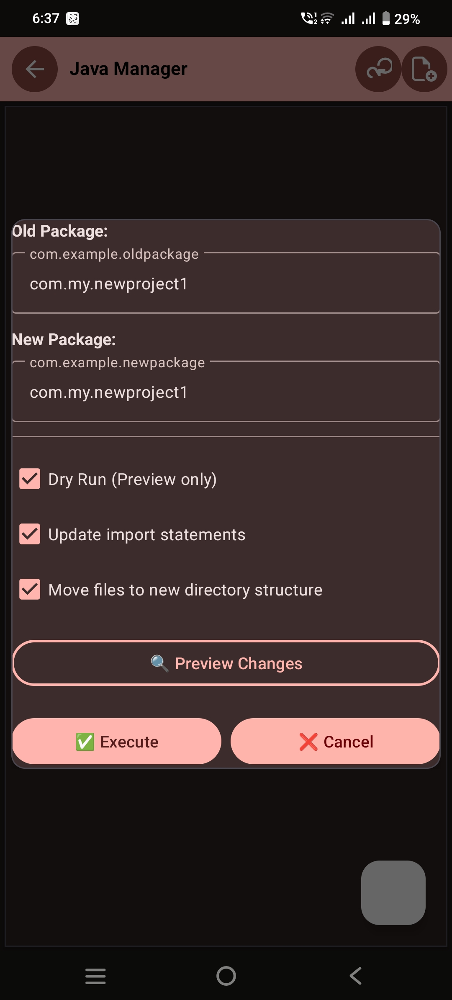
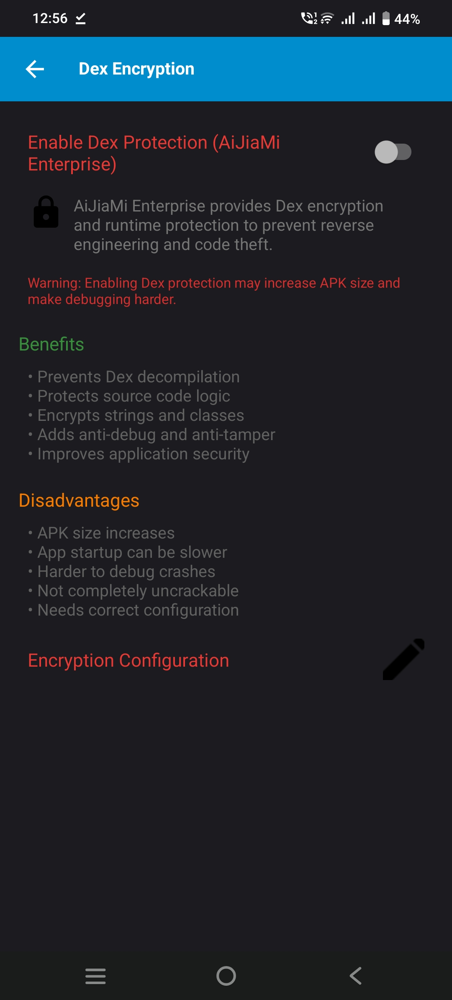
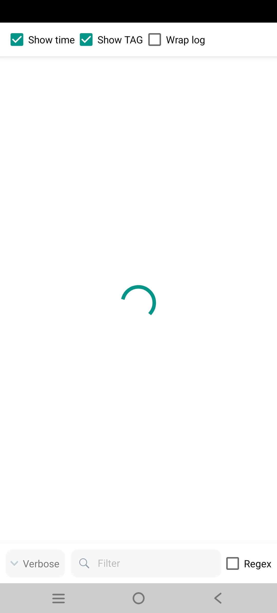
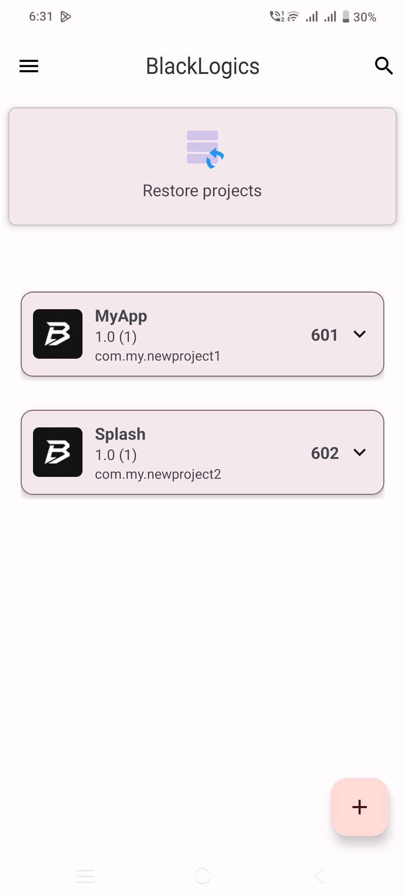
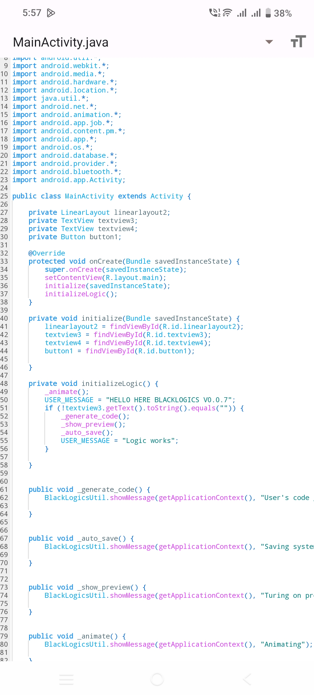
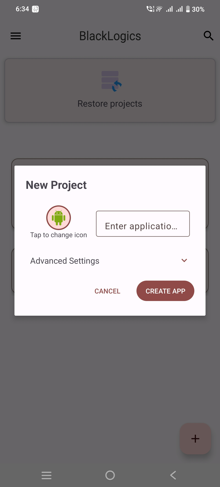
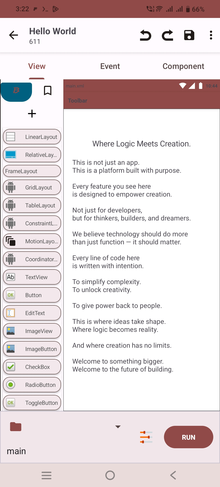
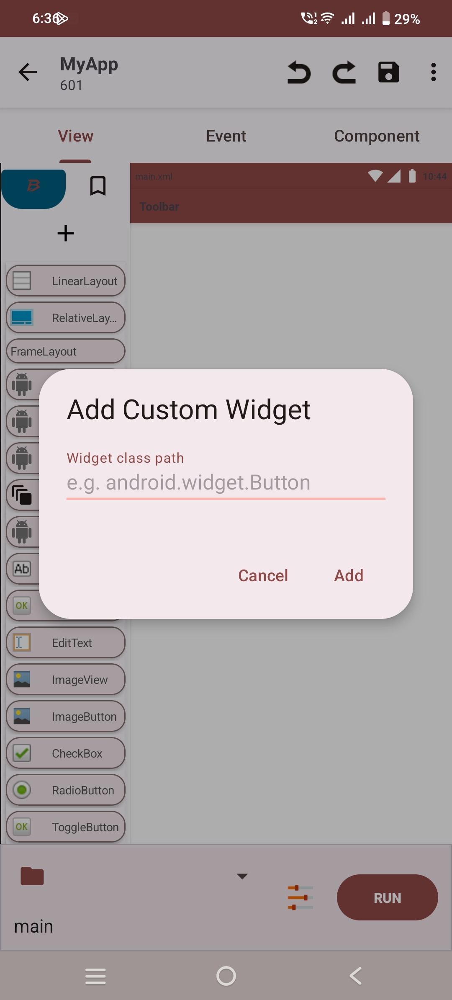
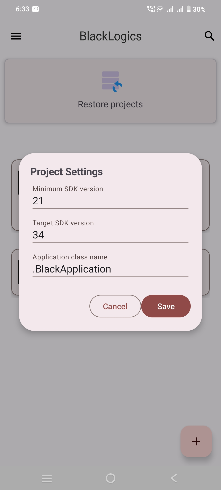
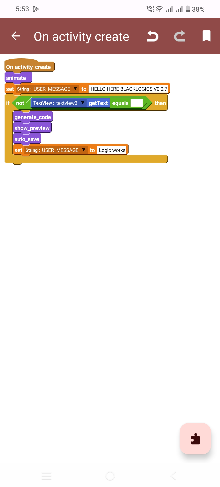

<div align="center">


<br/><br/>

# ◼ BlackLogics

### Advanced Visual Integrated Development Environment

**A next-generation, open-source IDE for modern Android development.**  
Built entirely from the ground up by **NexusTeam**, empowering developers through  
an intuitive logic-based visual system and a professional resource management suite.

<br/>

[📦 Clone & Install](#️-installation) · [✨ Features](#-key-features) · [🤝 Contribute](#-contributing) · [💬 Community](#-connect-with-us)

---

</div>

## ✦ Overview

**BlackLogics** is not a fork — it is an independent IDE architecture conceived and built by **NexusTeam (Smart India Gaming)**. It bridges the gap between visual drag-and-drop simplicity and the full power of the Android SDK, making professional-grade Android development accessible without sacrificing depth or capability.

---

## 🚀 Key Features

### 🛠️ Professional Development Suite

- **Independent Architecture** — Custom high-performance core built from scratch by NexusTeam, no inherited legacy baggage.
- **Full AndroidX Support** — First-class integration with Jetpack libraries and modern SDK features.
- **Live String Rendering** — Reference `@string/your_string` and see the localized value update in real-time inside the visual editor.
- **Material Design 1.9** — Access Navigation Rails, Bottom Bars, Advanced Dialogs, and a complete modern component library.

---

### 🧩 Logic & UI Engine

- **Visual Logic Editor** — Define complex app behaviors using a high-level block system — zero manual Java boilerplate required.
- **Drag-and-Drop UI Designer** — Construct responsive layouts visually with an advanced XML-to-UI translation engine.
- **Dynamic Theming** — Native Dark/Light mode support with instant one-tap configuration.

---

### 📦 Advanced Resource Management

| Manager | Capability |
| :--- | :--- |
| **Java & Native (JNI)** | Inject custom Java classes and C++ native libraries for high-performance tasks |
| **Asset & Sound** | Streamlined management of fonts, raw data, and high-fidelity audio files |
| **Permission System** | Granular Manifest permission control with a simplified toggle interface |
| **Resource Encryption** | Industrial-grade security for XML, assets, and drawables to protect your IP |

---

### 🚀 Package Refactor Tool

Safely rename your application package with **automatic import updates** and full directory restructuring — no broken references, no manual find-and-replace.



---

### 🔐 Advanced Dex Encryption — *AiJiaMi Enterprise*

Protect your APK from reverse engineering and code theft with enterprise-grade Dex encryption and runtime protection.

| Capability | Status |
| :--- | :---: |
| Prevents Dex decompilation | ✅ |
| Encrypts classes and strings | ✅ |
| Anti-debug & anti-tamper protection | ✅ |
| Configurable encryption settings | ✅ |
| Dry-run safe integration | ✅ |

> ⚠️ **Note:** Enabling Dex encryption may increase APK size and make runtime debugging more complex. Recommended for production builds only.



---

### 🧾 Built-in Logcat Viewer

Monitor real-time application logs **directly inside the IDE** — no switching to external tools.

- Show time & TAG metadata
- Log level filtering — Verbose, Debug, Info, Warning, Error
- Search & Regex filtering
- Line wrap toggle
- Clean, responsive dark-mode UI



---

## 🌙 Dark Mode — Built for Developers

BlackLogics ships with a meticulously crafted Dark Mode that goes beyond a simple color swap.

| Feature | Detail |
| :--- | :--- |
| **True Black UI** | Optimized for AMOLED displays — saves battery, looks premium |
| **Eye Comfort** | Reduced blue light for long late-night sessions |
| **High-Contrast Logic Blocks** | Blocks and syntax stay sharp and readable at any hour |
| **System Integration** | Automatically follows your device theme settings |

> 💡 **Pro Tip:** Toggle between Light and Dark themes instantly from Settings — no restart required.

---

## 📸 Interface Preview

<table>
  <tr>
    <td align="center"><b>Dashboard</b></td>
    <td align="center"><b>Source Code Management</b></td>
    <td align="center"><b>Workspace Setup</b></td>
  </tr>
  <tr>
    <td></td>
    <td></td>
    <td></td>
  </tr>
  <tr>
    <td align="center"><b>Visual UI Editor</b></td>
    <td align="center"><b>Component Library</b></td>
    <td align="center"><b>SDK Configuration</b></td>
  </tr>
  <tr>
    <td></td>
    <td></td>
    <td></td>
  </tr>
</table>

**Logic Workflow Editor**



---

## ⚙️ Requirements & Installation

### System Requirements

| Component | Requirement |
| :--- | :--- |
| **JDK** | Java 8 or higher |
| **Android SDK** | API Level 21+ (Lollipop → Latest) |
| **Build System** | Gradle (Android Studio or standalone) |

### Installation

**1. Clone the repository**
```bash
git clone https://github.com/NexusTeamOfficial/BlackLogics-Open-Source.git
```

**2. Open the project**  
Import the cloned directory into your Android development environment.

**3. Sync dependencies**  
Allow Gradle to resolve all required AndroidX and Material libraries automatically.

**4. Build & deploy**  
Run on a physical device or emulator targeting API 21+.

---

## 🤝 Contributing

Contributions are welcome — bug fixes, UI/UX improvements, new features, or documentation enhancements all make a difference.

```bash
# 1. Fork the repository and clone your fork
git clone https://github.com/YOUR_USERNAME/BlackLogics-Open-Source.git

# 2. Create a feature branch
git checkout -b feature/YourFeatureName

# 3. Commit your changes with a clear message
git commit -m "Add: description of your change"

# 4. Push and open a Pull Request
git push origin feature/YourFeatureName
```

Please ensure your PR includes a clear description of what was changed and why.

---

## 👥 Core Development Team

| Member | Role |
| :--- | :--- |
| **NexusTeam** | Lead Architecture & UI Framework |
| **SmartIndiaGaming** | Firebase Systems & Multimedia Integration |

---

## 🌟 Contributors

| Name | Role | GitHub |
| :--- | :--- | :--- |
| **Gaurav** | Android Developer — contributions, testing & feature improvements | [@GauravDeveloper-Android](https://github.com/GauravDeveloper-Android) |

---

## 💙 Special Acknowledgement

BlackLogics development is actively supported by **[Gaurav](https://github.com/GauravDeveloper-Android)** for Android development contributions, testing, and ongoing feature improvements.

---

## 📄 License

This project is licensed under the **GNU General Public License v3.0 (GPL-3.0)**.

**You are free to:**
- Use, modify, and distribute this software
- Self-host and deploy

**Under the following conditions:**
- Modified source code must be disclosed publicly
- Proper attribution must be maintained
- The GPL-3.0 license must be preserved
- Network-based deployments must also provide source access

See the [`LICENSE`](LICENSE) file for full legal text.

---

### 💼 Commercial License

For use cases requiring attribution removal, proprietary integration, or closed-source deployment — a **Commercial License** is available.

See [`COMMERCIAL-LICENSE.md`](COMMERCIAL-LICENSE.md) for details.

---

## 📜 License Transition Notice

| Version | License |
| :--- | :--- |
| `v0.0.6` and earlier | MIT License |
| `v0.0.7` and later | GNU GPL-3.0 |

All new development and future releases are governed under **GPL-3.0**.  
For proprietary usage of `v0.0.7+`, a commercial license is required.

---

## 🔖 Third-Party Acknowledgements

BlackLogics deeply respects the open-source community and its contributors.

### Logcat Integration Module

- **Repository:** [YurkivTaras/logcat](https://github.com/YurkivTaras/logcat)
- **Original Author:** Yuriy Taras
- **License:** Apache License 2.0

Portions of the Logcat viewer are derived from the above repository. All intellectual property and ownership of third-party components remain solely with their respective original authors. BlackLogics does not claim ownership of third-party code and distributes all such components strictly in accordance with their original licenses.

The Apache License 2.0 is available at: http://www.apache.org/licenses/LICENSE-2.0

> 💙 Sincere thanks to all open-source contributors whose work makes projects like this possible.

---

## 🔗 Connect With Us

<div align="center">

[](https://t.me/blacklogics)
[](https://youtube.com/@blacklogics)
[](https://github.com/NexusTeamOfficial/BlackLogics-Open-Source)

<br/>

*Made with passion by **NexusTeam** & **SmartIndiaGaming***

</div>
