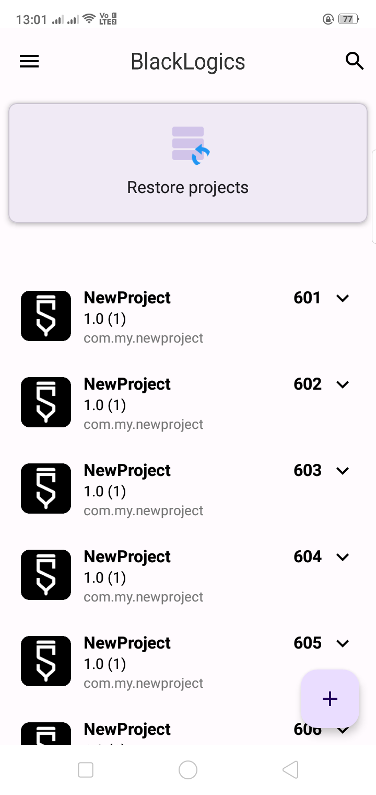
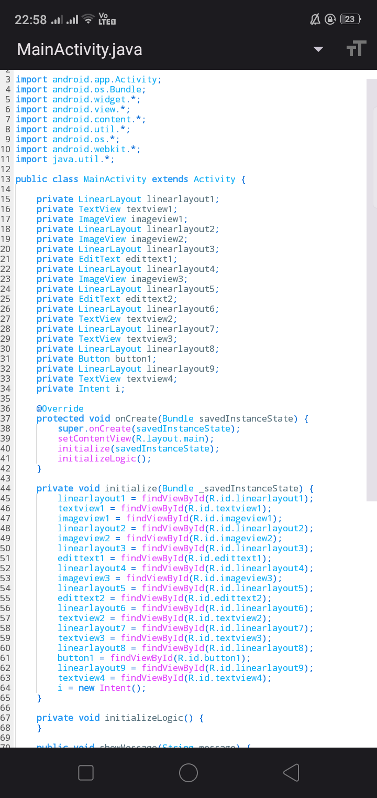
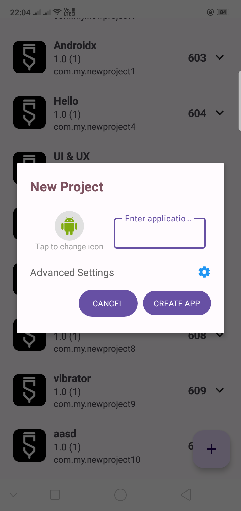
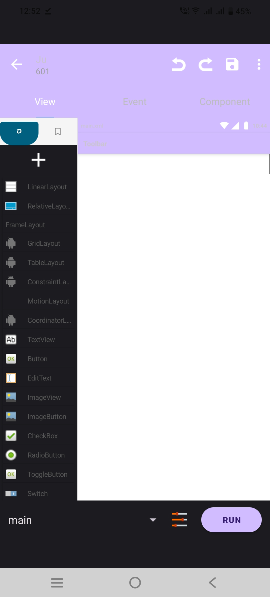
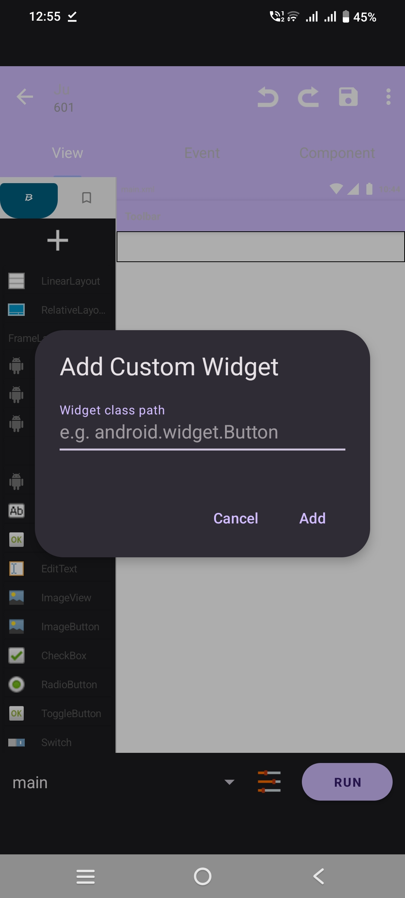
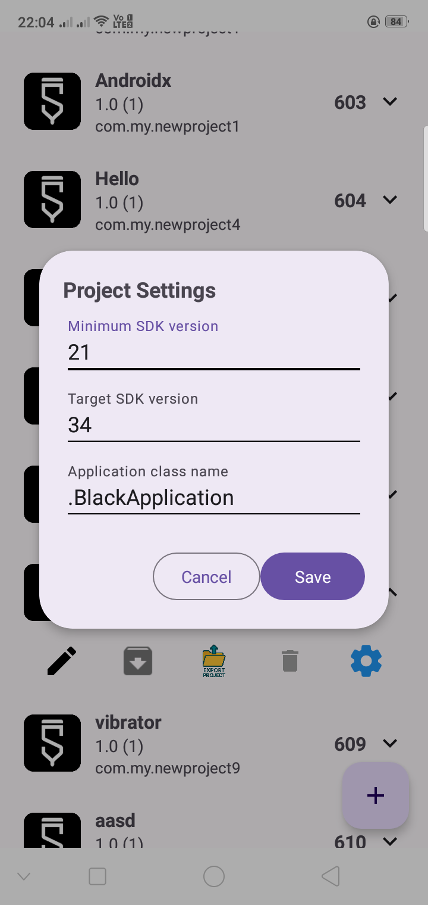
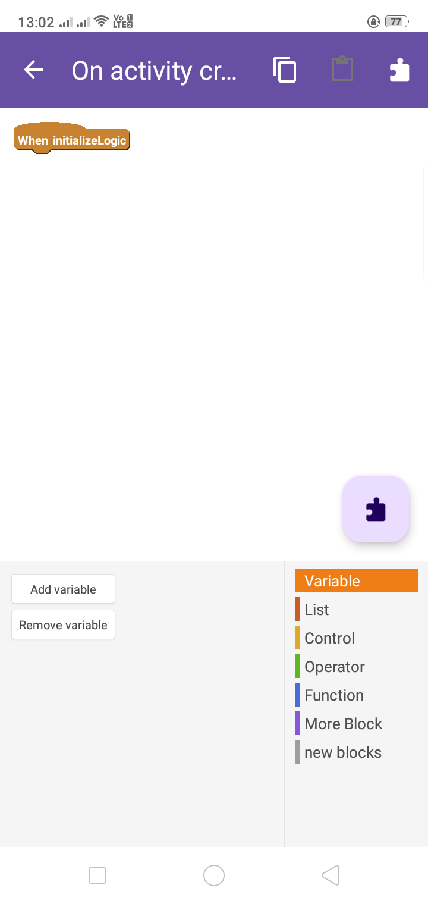
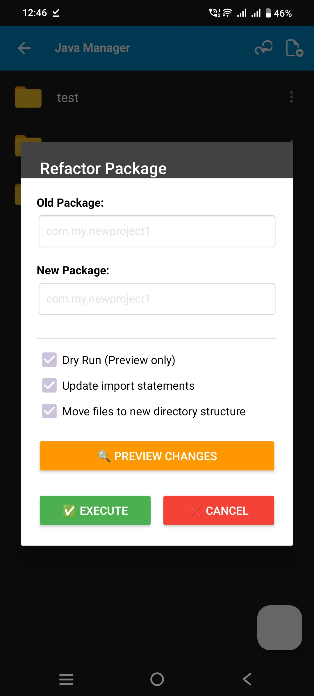

# BlackLogics – Advanced Visual Integrated Development Environment

**BlackLogics** is a next-generation, open-source IDE designed for modern Android development. Built on a fully independent architecture by **NexusTeam**, it empowers developers to build high-performance, **AndroidX-compatible** applications through an intuitive logic-based system and a robust suite of resource management tools.

---

## 🚀 Key Features

### 🛠️ Professional Development Suite
* **Independent Architecture:** Developed from the ground up by NexusTeam (Smart India Gaming) with a custom, high-performance core.
* **Full AndroidX Support:** Seamlessly integrate the latest Jetpack libraries and modern SDK features.
* **Live String Rendering:** Experience real-time UI updates. Reference `@string/your_string` and see the localized value instantly within the visual editor.
* **Material Design 1.9:** Access a comprehensive library of modern components including Navigation Rails, Bottom Bars, and Advanced Dialogs.

### 🧩 Logic & UI Engine
* **Visual Logic Editor:** Define complex app behaviors using a high-level block system—no manual Java boilerplate required.
* **Drag-and-Drop UI Designer:** Build responsive layouts visually with an advanced XML-to-UI translation engine.
* **Dynamic Theming:** Native support for Dark and Light modes with one-tap configuration.

### 📦 Advanced Resource Management
| Manager | Capability |
| :--- | :--- |
| **Java & Native (JNI)** | Inject custom Java classes and C++ native libraries for high-performance tasks. |
| **Asset & Sound** | Streamlined management of fonts, raw data, and high-fidelity audio files. |
| **Permission System** | Granular control over Android Manifest permissions with a simplified toggle interface. |
| **Resource Encryption** | Industrial-grade security for your XML, assets, and drawables to protect intellectual property. |

---

## 📸 Interface Preview

<table>
  <tr>
    <td align="center"><b>Dashboard</b></td>
    <td align="center"><b>Source Code Management</b></td>
    <td align="center"><b>Workspace Setup</b></td>
  </tr>
  <tr>
    <td></td>
    <td></td>
    <td></td>
  </tr>
  <tr>
    <td align="center"><b>Visual UI Editor</b></td>
    <td align="center"><b>Component Library</b></td>
    <td align="center"><b>SDK Configuration</b></td>
  </tr>
  <tr>
    <td></td>
    <td></td>
    <td></td>
  </tr>
</table>

### **Logic Workflow**



### 🚀 New: Package Refactor Tool
Safely rename package with automatic import updates and directory restructuring.



### 🔐 Advanced Dex Encryption (AiJiaMi Enterprise)

Protect your APK from reverse engineering and code theft with enterprise-grade Dex encryption and runtime protection.

**Features:**
• Prevents Dex decompilation  
• Encrypts classes and strings  
• Anti-debug & anti-tamper protection  
• Configurable encryption settings  
• Dry-run safe integration  

⚠ Note: Enabling this may increase APK size and make debugging harder.


---

## 🌙 Optimized for the Dark Side
We know developers live in the dark. That’s why **BlackLogics** comes with a meticulously crafted Dark Mode that’s more than just a color swap—it's an experience.

### Why you'll love it:
* **True Black UI:** Optimized for AMOLED screens to save battery and look sleek. 🔋
* **Eye Comfort:** Reduced blue light exposure for those long late-night coding sessions. 🦉
* **High-Contrast Blocks:** Logic blocks and code syntax remain sharp and easy to read. 💻
* **System Integration:** Automatically follows your device's theme settings.

| Light Mode (Classic) | Dark Mode (Pro) |
|---|---|
|  |  |

> **Pro Tip:** You can toggle between themes instantly in the settings without restarting the app!

## ⚙️ Technical Requirements & Installation

### Environment
* **JDK:** Java 8 or higher
* **Platform:** Android SDK 21+ (Lollipop to latest)
* **IDE Framework:** Compatible with Android Studio & standalone Gradle environments

### Installation
1.  **Clone the Repository**
    ```bash
    git clone [https://github.com/NexusTeamOfficial/BlackLogics-Open-Source.git](https://github.com/NexusTeamOfficial/BlackLogics-Open-Source.git)
    ```
2.  **Open Project:** Import the directory into your preferred Android development environment.
3.  **Sync Dependencies:** Allow Gradle to resolve the necessary AndroidX and Material libraries.
4.  **Deploy:** Build and run on a physical device or emulator.

---

## 🤝 Contribution & Community

We believe in the power of open-source. Whether you are fixing bugs, improving the UI/UX, or adding new features, your contributions are welcome.

1.  **Fork** the repository.
2.  **Create** a feature branch (`git checkout -b feature/NewCapability`).
3.  **Commit** your changes (`git commit -m 'Add specialized feature'`).
4.  **Push** and open a **Pull Request**.

### Core Development Team
* **NexusTeam:** Lead Architecture & UI Framework.
* **SmartIndiaGaming:** Firebase Systems & Multimedia Integration.

---

## 📄 License
This project is licensed under the **MIT License**. See the [LICENSE](LICENSE) file for full details.

---

---

## 📜 Credits & Third-Party Acknowledgements

At **BlackLogics**, we deeply respect the open-source community and the developers who contribute to it.

This project incorporates certain components from the following open-source repository:

### 🔹 Logcat Integration Module

- **Repository:** [YurkivTaras/logcat](https://github.com/YurkivTaras/logcat)  
- **Original Author:** Yuriy Taras  
- **License:** Apache License, Version 2.0  

Portions of this software are derived from the above repository.

All copyrights, intellectual property rights, and ownership of the respective third-party components remain solely with their original author(s).

BlackLogics does not claim ownership of third-party code and distributes such components strictly in accordance with their original open-source licenses.

The Apache License, Version 2.0, can be found in the `LICENSE` file of this repository or at:  
http://www.apache.org/licenses/LICENSE-2.0

---

> 💙 We sincerely thank the original author and all open-source contributors for their valuable work.

BlackLogics fully respects all open-source licenses and ensures proper attribution and compliance with their terms, including but not limited to GPL, MIT, Apache License 2.0, and other applicable licenses.

## 🔗 Connect With Us
* **Official Telegram:** [@BlackLogicsOfficial](https://t.me/blacklogics)
* **YouTube Channel:** [@BlackLogics](https://youtube.com/@blacklogics)
* **GitHub Repository:** [NexusTeamOfficial/BlackLogics-Open-Source](https://github.com/NexusTeamOfficial/BlackLogics-Open-Source)

> Made with passion by **NexusTeam** & **SmartIndiaGaming**
