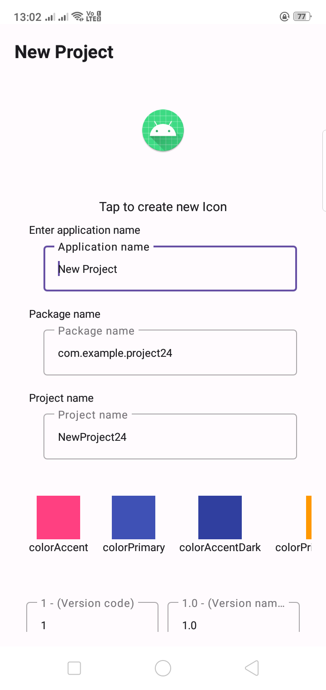
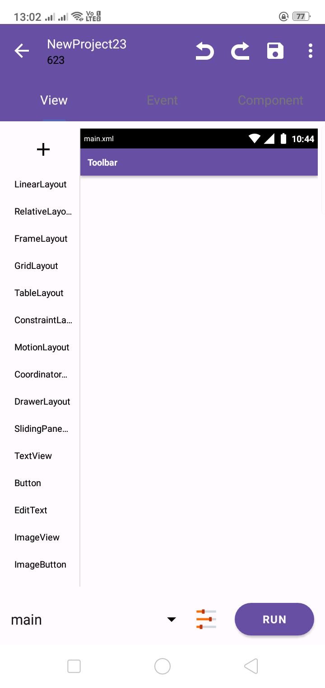
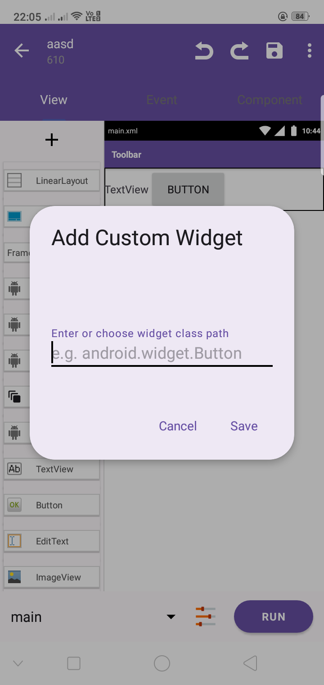
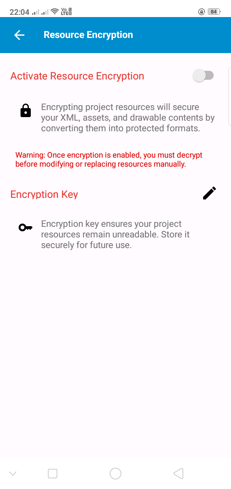
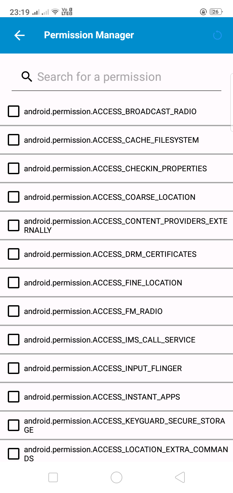
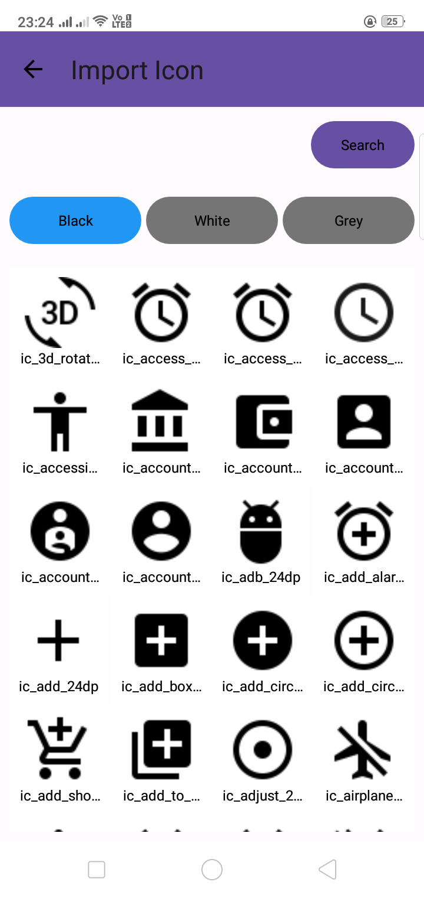

# BlackLogics – Visual Android App Builder

**BlackLogics** is a powerful open-source Android app builder with full **AndroidX support**. It allows anyone to build modern apps visually — without writing traditional code — using a logic-based system, drag-and-drop UI editor, and full resource management.

## Important notic
- **Ownership**
NexusTeam (Smart India Gaming) developed, fully custom architecture, independent project

## Reference
- **Package name mismatch**
Just used com.besome.blacklogics but project are created toatlly original and project owner is nexusteam its not used sketchware base.


## ✨ Features

- **AndroidX Support**  
  Build apps using the latest Android libraries and SDKs.

- **No Code Required**  
  Create app logic using the built-in visual **Logic Editor** — no Java needed.

- **Material Design 1.9 Components**  
  Includes buttons, dialogs, toolbars, bottom navigation, and more.

- **Dark & Light Theme Support**  
  One-tap switch between light and dark mode.

- **String References in Layout Editor**  
  You can use `@string/your_string` in the visual UI editor, and the actual value from `strings.xml` **will be displayed live** in the editor as well as at runtime.
  

- **Advanced Resource Managers**
  - **Assets Manager** – Manage fonts, audio, raw files
  - **Image Manager** – Handle app icons and UI graphics
  - **Java Manager** – Add custom Java code blocks
  - **Native Manager** – Add native libraries (JNI)
  - **Permission Manager** – Manage app permissions
  - **Sound Manager** – Add and manage audio files

- **Drag & Drop UI Builder**  
  Design your app interface visually without XML.

---

## 📸 Screenshots

<table>
  <tr>
    <td align="center">
      <br/>
      <sub>Main UI</sub>
    </td>
    <td align="center">
      <br/>
      <sub>Project List UI</sub>
    </td>
    <td align="center">
      <br/>
      <sub>Creating a New Project</sub>
    </td>
  </tr>
  <tr>
    <td align="center">
      <br/>
      <sub>Project SDK Configuration</sub>
    </td>
    <td align="center">
      <br/>
      <sub>Design Activity (Visual UI Editor)</sub>
    </td>
    <td align="center">
      <br/>
      <sub>Adding a Custom Widget</sub>
    </td>
  </tr>
</table>
  
### **Logic Editor**


### **Resource Encryption**

> **Warning:** Encrypting resources secures XML, assets, and drawables, requiring manual decryption before modification.

### **Permission Manager**


### **Import Icons**

---

## ⚙️ Installation Guide

> This project is open-source and compatible with Android Studio & Sketchware Pro.

### Requirements

- Android Studio / Sketchware Pro
- Android SDK 21+
- Java 8+
- Internet (for Firebase features)

### Steps

1. **Clone the Repository**
   ```bash
   git clone https://github.com/NexusTeamOfficial/BlackLogics-Open-Source.git

2. **Open in Android Studio** or import into Sketchware Pro

3. **Sync Gradle** and resolve dependencies

4. **Build and run the app** on your device or emulator

## 👨‍💻 Contributing

We welcome all contributions to make BlackLogics even better!

### How to Contribute

1. **Fork the repository**

2. **Create a new branch**

   ```bash
   git checkout -b feature/YourFeatureName
   ```

3. **Make your changes**

4. **Commit your changes**

   ```bash
   git commit -m "Add: YourFeatureName"
   ```

5. **Push your branch**

   ```bash
   git push origin feature/YourFeatureName
   ```

6. **Submit a Pull Request**

## 🙌 Contributors

We thank all contributors who made BlackLogics possible.


## Core Developers

- **NexusTeam**  
  Lead development, architecture, and UI system.

- **SmartIndiaGaming**  
  Firebase integration, multimedia features, and testing.

---

## Special Thanks

- **Sketchware Pro Community**  
  Inspiration and continued support for open-source visual coding.

- **Material Design Contributors**  
  For providing resources and guidelines.

---

## Want to Contribute?

Your name will be added here when you submit your first **pull request** or contribute significantly to:

- UI/UX improvements  
- Bug fixes  
- Feature additions  
- Translations  
- Documentation updates

> Thank you for making BlackLogics better for everyone!


## 📄 License

```text
MIT License

Copyright (c) 2025 BlackLogics

Permission is hereby granted, free of charge, to any person obtaining a copy
of this software and associated documentation files (the "Software"), to deal
in the Software without restriction, including without limitation the rights  
to use, copy, modify, merge, publish, distribute, sublicense, and/or sell  
copies of the Software, and to permit persons to whom the Software is  
furnished to do so, subject to the following conditions:

The above copyright notice and this permission notice shall be included  
in all copies or substantial portions of the Software.

THE SOFTWARE IS PROVIDED "AS IS", WITHOUT WARRANTY OF ANY KIND, EXPRESS OR  
IMPLIED, INCLUDING BUT NOT LIMITED TO THE WARRANTIES OF MERCHANTABILITY,  
FITNESS FOR A PARTICULAR PURPOSE AND NONINFRINGEMENT.
```

---

## 🔗 Stay Connected

* **Telegram:** [@BlackLogicsOfficial](https://t.me/blacklogics)
* * **YouTube:** [@BlackLogics](https://youtube.com/@blacklogics?si=D2CFbND9d2ivbA_7)
* **GitHub:** [NexusTeamOfficial/BlackLogics-Open-Source](https://github.com/NexusTeamOfficial/BlackLogics-Open-Source)

> Made with passion by **NexusTeam** & **SmartIndiaGaming**
